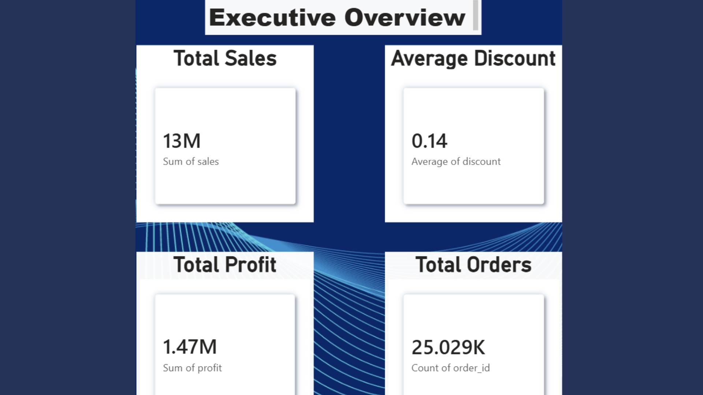
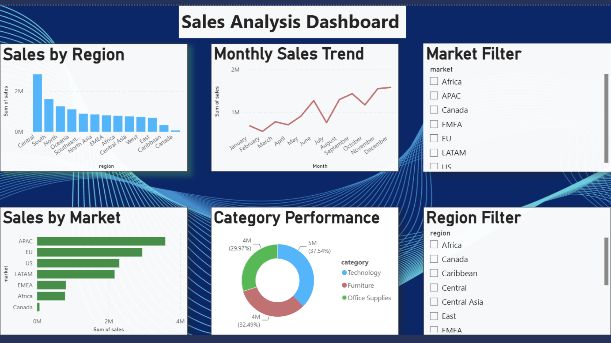
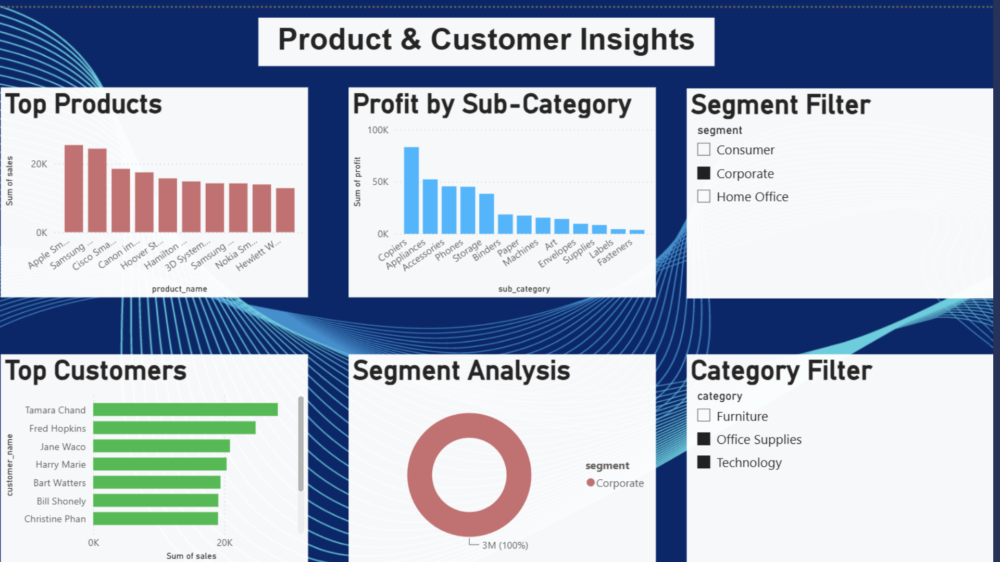
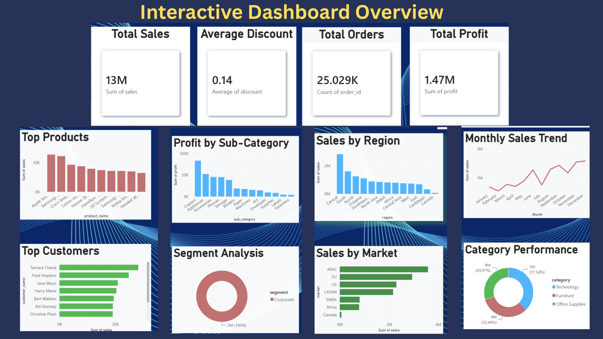

# 📊 E-Commerce Sales Analysis Dashboard

An end-to-end Data Analytics project that transforms raw e-commerce sales data into actionable business insights using SQL, Microsoft Excel, and Power BI.

---

## 📌 Project Overview

The objective of this project is to analyze e-commerce sales data, identify key business trends, and build an interactive dashboard that helps stakeholders make data-driven decisions.

The dashboard provides insights into sales performance, profitability, customer behavior, product performance, and regional trends.

---

## 🎯 Business Objectives

- Analyze overall sales and profit performance
- Identify top-performing products and customers
- Compare sales across different regions and markets
- Track monthly sales trends
- Evaluate category and sub-category performance
- Build an interactive dashboard for business decision-making

---

## 🛠️ Tech Stack

- SQL
- Microsoft Excel
- Power BI

---

## 📈 Key KPIs

- 💰 Total Sales: **13M+**
- 💵 Total Profit: **1.47M+**
- 🛒 Total Orders: **25K+**

---

## 📊 Dashboard Features

- Executive Overview
- Monthly Sales Trend Analysis
- Sales by Region
- Sales by Market
- Category-wise Sales Analysis
- Profit by Sub-category
- Top Customers
- Top Products
- Interactive Filters & Slicers

---

## 📂 Repository Structure

```
Dashboard/
Dataset/
SQL/
Presentation/
Images/
README.md
```

---

## 💡 Key Insights

- Identified the highest-performing regions based on sales.
- Analyzed monthly sales trends to understand seasonality.
- Evaluated category and sub-category profitability.
- Identified top customers contributing to revenue.
- Compared sales performance across different markets.
- Built an interactive dashboard for faster business analysis.

---

## 📸 Dashboard Preview
### EXecutive Overview



### Sales Analysis Dashboard



### Product & Customer insights



### Overview



---

## 📁 Project Files

- Cleaned Dataset (.csv)
- SQL Quries (.sql)
- Excel Analysis (.xlsx)
- Power BI Dashboard (.pbix)
- Final Business Insights Report(.pdf)
- Project Presentation (.pdf)
---

## 🚀 Skills Demonstrated

- Data Cleaning
- Data Analysis
- Data Visualization
- Dashboard Design
- Business Intelligence
- SQL Querying
- Excel Analytics
- Business Storytelling

---

## 👩‍💻 About Me

Hi, I'm **Pinky**, an aspiring Data Analyst passionate about transforming data into actionable insights using SQL, Excel, Power BI, and Python.

I'm actively looking for opportunities where I can contribute to data-driven business decisions while continuously improving my analytical skills.

📧 Email: **70.pinky.pal@gmail.com**

🔗 LinkedIn: *(www.linkedin.com/in/pinkypal   )*

---

⭐ If you found this project helpful, feel free to star this repository!
